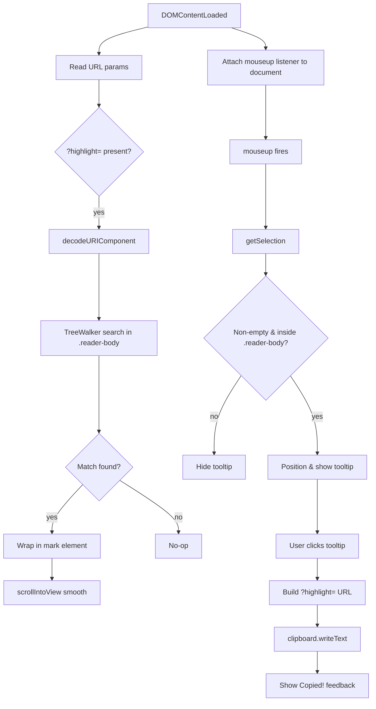

# Design Document: text-highlight-share

## Overview

The text-highlight-share feature adds two complementary capabilities to article pages in the `/n8n/guide/` section:

1. **Share a selection** — when a reader highlights text in the `.reader-body`, a floating Share_Tooltip appears near the selection. Clicking it copies a URL with a `?highlight=<encoded-text>` query parameter to the clipboard.
2. **Restore a highlight** — when a page loads with a `?highlight=` parameter, the Highlight_JS module finds the first matching text in the Reader_Body, wraps it in a `<mark>` element, and scrolls it into view.

A new test article at `n8n/guide/test/index.html` is created as the implementation target, following the exact same HTML template as existing articles.

---

## Architecture

The feature is implemented as a single self-contained JavaScript module (`assets/js/text-highlight-share.js`) that is included via a `<script>` tag at the bottom of each article page that opts in. No build step, no external dependencies, no framework.

```
assets/
  js/
    text-highlight-share.js   ← new module (all feature logic)
  css/
    n8n.css                   ← add .highlight-tooltip and mark styles

n8n/guide/
  test/
    index.html                ← new test article (opts in to the module)
```

The module is structured as an IIFE (Immediately Invoked Function Expression) to avoid polluting the global scope. It runs two independent routines on `DOMContentLoaded`:

- **Selection listener** — attaches `mouseup` and `selectionchange` event handlers to detect and respond to user selections.
- **Restore routine** — reads `?highlight=` from the URL and, if present, runs the TreeWalker search and wraps the match.



---

## Components and Interfaces

### 1. `text-highlight-share.js` module

**Public surface:** none (IIFE, no exports). Reads from and writes to the DOM only.

**Internal functions:**

| Function | Signature | Responsibility |
|---|---|---|
| `getReaderBody` | `() → Element \| null` | Returns `.reader-body` or null |
| `isInsideReaderBody` | `(node: Node) → boolean` | Checks if a node is a descendant of `.reader-body` |
| `buildHighlightUrl` | `(text: string) → string` | Returns `location.href` (stripped of existing `?highlight`) + `?highlight=encodeURIComponent(text)` |
| `copyToClipboard` | `(text: string) → Promise<void>` | Tries `navigator.clipboard.writeText`, falls back to `execCommand('copy')` |
| `showTooltip` | `(rect: DOMRect) → void` | Positions and shows the Share_Tooltip near the selection rect |
| `hideTooltip` | `() → void` | Hides the Share_Tooltip |
| `handleMouseUp` | `(event: MouseEvent) → void` | Reads current selection, validates it, calls showTooltip or hideTooltip |
| `findAndHighlight` | `(text: string) → void` | TreeWalker search + Range wrapping + scrollIntoView |
| `restoreHighlight` | `() → void` | Entry point for page-load restore; reads URL param, calls findAndHighlight |
| `overrideSidebarShare` | `() → void` | Patches the Sidebar_Share_Button onclick to inject highlight URL when selection is active |

### 2. Share_Tooltip DOM element

Created once on `DOMContentLoaded` and appended to `document.body`. Positioned with `position: fixed` so viewport-relative coordinates from `getClientRects()` can be used directly.

```html
<div id="ths-tooltip" role="tooltip" aria-label="Copy highlight link">
  <span class="ths-label">Share</span>
  <span class="ths-icon">↗</span>
</div>
```

### 3. CSS additions to `n8n.css`

Two new rule blocks appended to the existing stylesheet:

```css
/* Highlight marker (restored from URL) */
mark.ths-mark {
  background: #ffe066;
  color: inherit;
  border-radius: 2px;
  padding: 0 1px;
  animation: ths-pulse 1.2s ease-out forwards;
}

@keyframes ths-pulse {
  0%   { background: #ffb300; }
  100% { background: #ffe066; }
}

/* Floating share tooltip */
#ths-tooltip {
  position: fixed;
  display: none;
  align-items: center;
  gap: 0.4rem;
  padding: 0.35rem 0.75rem;
  background: var(--text);
  color: #fff;
  font-family: var(--font-sans);
  font-size: 0.7rem;
  font-weight: 700;
  text-transform: uppercase;
  letter-spacing: 0.1em;
  border-radius: var(--r);
  box-shadow: 0 4px 16px rgba(0,0,0,0.18);
  cursor: pointer;
  z-index: 9999;
  user-select: none;
  white-space: nowrap;
  transition: opacity 0.15s;
}

#ths-tooltip.ths-visible {
  display: flex;
}
```

---

## Data Models

### URL parameter schema

```
?highlight=<percent-encoded selected text>
```

- Encoding: `encodeURIComponent(selectedText.trim())`
- Decoding: `decodeURIComponent(param)`
- The parameter is stripped before re-encoding to avoid stacking on repeated shares: `url.searchParams.delete('highlight')` before setting the new value.
- Native Text Fragments are appended as a hash suffix when the selection is a single contiguous string: `#:~:text=<encodeURIComponent(text)>`

### Selection state (in-memory only)

```js
let currentSelection = null; // string | null — the trimmed selected text
```

No persistent state beyond the URL parameter.

---

## Correctness Properties

*A property is a characteristic or behavior that should hold true across all valid executions of a system — essentially, a formal statement about what the system should do. Properties serve as the bridge between human-readable specifications and machine-verifiable correctness guarantees.*

Property 1: Highlight URL round-trip
*For any* non-empty string `text`, encoding it with `buildHighlightUrl` and then decoding the `?highlight=` parameter from the resulting URL should produce a string equal to `text.trim()`.
**Validates: Requirements 4.1, 4.2, 5.1**

Property 2: Whitespace selections are suppressed
*For any* string composed entirely of whitespace characters, calling the selection handler should result in the Share_Tooltip remaining hidden and `currentSelection` remaining null.
**Validates: Requirements 2.2**

Property 3: Out-of-body selections are ignored
*For any* text selection whose anchor node is outside `.reader-body`, the Share_Tooltip SHALL remain hidden.
**Validates: Requirements 2.3**

Property 4: TreeWalker finds first match
*For any* Reader_Body DOM tree containing at least one text node that includes the search string (case-insensitive), `findAndHighlight` should wrap exactly one `<mark class="ths-mark">` element around the first occurrence.
**Validates: Requirements 5.2, 5.3**

Property 5: No match leaves DOM unchanged
*For any* Reader_Body DOM tree that does not contain the search string, `findAndHighlight` should leave the DOM identical to its state before the call (no `<mark>` elements inserted).
**Validates: Requirements 5.5**

Property 6: Tooltip stays within viewport
*For any* selection DOMRect, `showTooltip` should position the tooltip such that its bounding box does not overflow the viewport width or height.
**Validates: Requirements 3.4**

Property 7: Clipboard fallback is always attempted
*For any* environment where `navigator.clipboard` is undefined, `copyToClipboard` should invoke `document.execCommand('copy')` without throwing an unhandled exception.
**Validates: Requirements 4.5, 7.2**

---

## Error Handling

| Scenario | Handling |
|---|---|
| `navigator.clipboard` unavailable | Fall back to `execCommand('copy')` via a temporary `<textarea>` |
| `?highlight=` value decodes to empty string | Treat as absent; skip restore |
| No `.reader-body` element on page | All handlers exit early via `getReaderBody()` null check |
| `findAndHighlight` throws (malformed range) | Wrapped in try/catch; logs warning, leaves DOM unchanged |
| Selection spans across multiple block elements | `toString()` on the Range still returns the full text; wrapping uses the Range directly so multi-block selections are handled naturally |

---

## Testing Strategy

### Unit tests

Unit tests cover specific examples and edge cases using a lightweight DOM environment (e.g. jsdom via Jest or Vitest):

- `buildHighlightUrl` with a plain string, a string with spaces, and a string with special characters (`&`, `=`, `#`)
- `buildHighlightUrl` called on a URL that already has a `?highlight=` param — verifies the old param is replaced, not stacked
- `findAndHighlight` with an exact match, a case-insensitive match, and no match
- `copyToClipboard` fallback path when `navigator.clipboard` is undefined

### Property-based tests

Property tests use a PBT library (fast-check for JavaScript) with a minimum of 100 iterations per property.

Each property test is tagged with a comment in the format:
`// Feature: text-highlight-share, Property N: <property text>`

- **Property 1** — Generate arbitrary non-empty strings; assert round-trip equality after encode/decode.
- **Property 2** — Generate strings matching `/^\s+$/`; assert tooltip stays hidden.
- **Property 3** — Generate selections anchored outside `.reader-body`; assert tooltip stays hidden.
- **Property 4** — Generate a Reader_Body DOM with a randomly placed text node containing the search string; assert exactly one `<mark>` is inserted at the first occurrence.
- **Property 5** — Generate a Reader_Body DOM that does not contain the search string; assert DOM is unchanged after `findAndHighlight`.
- **Property 6** — Generate arbitrary DOMRect values within a simulated viewport; assert tooltip bounding box stays within viewport bounds.
- **Property 7** — Simulate missing `navigator.clipboard`; assert `copyToClipboard` resolves without throwing.

### Dual approach rationale

Unit tests catch concrete bugs in specific inputs (e.g. the `&` character in a URL). Property tests verify that the invariants hold across the full input space, catching edge cases that specific examples would miss (e.g. Unicode text, very long selections, selections at the very start or end of the Reader_Body).
